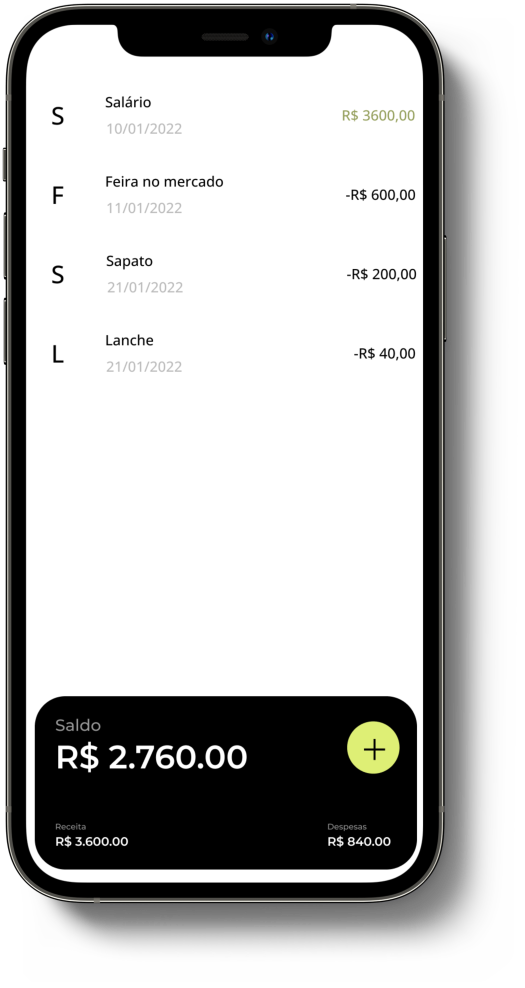
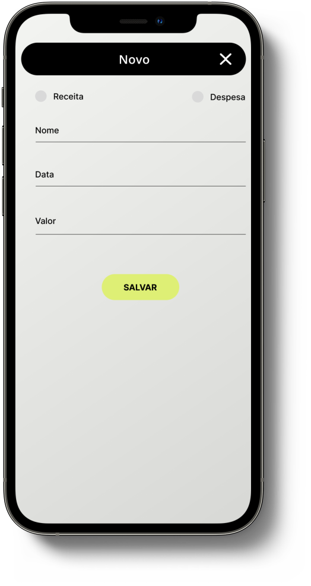

#  Telas do App:
<table>
  <tr>
    <th> SplashScreen </th>
    <th> Principal </th>
    <th> Cadastro/Atualização </th>
  <tr>
    <td>  </td>
    <td>  </td>
    <td>  </td>
   </tr>
  </tr>
</table>

